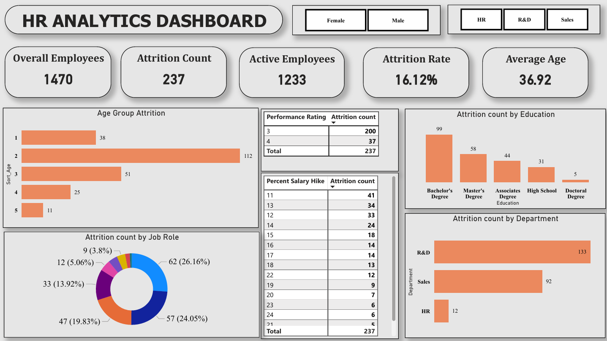

# HR Analytics Dashboard

## 📊 Dashboard Preview

### HR Analytics Dashboard Overview

### HR Attrition Insights Dashboard
 
 
## 🗂️ Table of Contents

1.🎯 Project Objective & Summary

2.📦 Problem Statement & Business Problem

3.📌 Business Objectives

4.🧾 Project Overview 

    5.⚙️ Project Setup, Code Organization & Usage
    ├── 🏗️ Project Setup
    ├── 💻 Installation Instructions
    ├── 📂 Folder Structure & Code Organization & Implementation
    ├── ▶️ Usage / How to Run
    └── 🌐 Live Demo / Deployment Link

6.🧩 Dataset Information (Data Source, Data Details & Data Dictionary)

7.🧰 Tools,Technologies & Skills Used

8.🧮 Steps / Methodology / Approach

9.🐍 Code / Implementation (Python)

10.🧠 Exploratory Data Analysis (EDA) & Visualizations

11.📝 SQL Analysis (MySQL)

12.📈 Analysis , Modeling, Dashboard Creation (Tableau) ,  Dashboard Screenshots (Tableau)  & Visual Outputs 
    
13.💡 Key Insights, Findings & Business Takeaways

14.❓ Key Questions to Answer

15.🚀 Challenges, Gotchas & Learnings

16.🗂 Deliverables

17.🗄️ Business Impact

18.⚙️ Skills Demonstrated

19.📚 References & Resources

20.👨‍💻 Authors / Contributors

21.📜 License

22.🏁 Conclusion

## Step 1.🎯 Project Objective & Summary

Employee attrition is one of the most critical challenges faced by organizations. High employee turnover leads to increased hiring costs, loss of knowledge, reduced productivity, and disruption in business operations. Understanding the key factors influencing employee attrition helps organizations design strategies to retain talent and improve workforce stability.

The objective of this project is to analyze employee data and identify patterns that contribute to employee attrition. Using data analytics and visualization techniques, this project builds an interactive HR Analytics Dashboard that enables HR teams and management to monitor attrition trends, identify high-risk employee segments, and make data-driven decisions.

The dashboard provides insights into various employee attributes such as:

* Age groups
* Department
* Job roles
* Education levels
* Business travel frequency
* Job satisfaction
* Work-life balance
* Job involvement

By analyzing these factors, the dashboard highlights patterns and correlations that influence employee turnover and helps HR leaders develop targeted retention strategies.

## Step 2.📦 Problem Statement & Business Problem

Employee attrition can negatively impact organizational growth and stability. Companies often struggle to understand why employees leave and which factors contribute most significantly to attrition.

Key challenges organizations face include:

* Identifying departments with the highest turnover
* Understanding which employee groups are most likely to leave
* Analyzing whether salary increases influence retention
* Determining if work-life balance affects employee satisfaction
* Understanding the impact of business travel on employee turnover

Without proper data analysis and visualization tools, HR teams find it difficult to monitor these patterns and make strategic decisions.

This project aims to solve these challenges by transforming raw HR data into meaningful insights through data analysis and visualization.

## Step 3.📌 Business Objectives

The primary business objectives of this project are:

* Analyze employee attrition patterns across departments and roles
* Identify the key factors influencing employee turnover
* Provide HR managers with a visual dashboard to monitor attrition trends
* Enable data-driven decision-making for employee retention strategies
* Understand how factors like work-life balance, job satisfaction, and business travel      impact employee retention

By achieving these objectives, organizations can proactively reduce attrition and improve employee engagement.

## Step 4.🧾 Project Overview 

This project focuses on analyzing HR employee data to identify patterns and trends related to employee attrition. The dataset includes employee demographic information, job-related attributes, compensation details, satisfaction ratings, and work experience metrics.

Using Power BI, the dataset was cleaned, transformed, and visualized to create a comprehensive HR analytics dashboard.

The dashboard consists of multiple visualizations that provide insights into:

* Total employee count
* Attrition rate
* Active employees
* Average employee age
* Attrition by department
* Attrition by job role
* Attrition by age group
* Attrition by education level
* Attrition by job satisfaction
* Attrition by job involvement
* Attrition by work-life balance
* Attrition by business travel frequency

These visualizations help HR teams quickly understand where attrition is occurring and which factors are most strongly correlated with employee turnover.

## Step 5. ⚙️ Project Setup, Code Organization & Usage
            ├── 🏗️ Project Setup
            |── 💻 Installation Instructions
            ├── 📂 Folder Structure & Code Organization & Implementation
            ├── ▶️ Usage / How to Run
            └── 🌐 Live Demo / Deployment Link
🏗️ Project Setup

* Download the dataset

* Import the dataset into Power BI

* Perform data cleaning and transformation

* Create calculated columns and measures

* Design the dashboard visuals

* Publish or export the dashboard

💻 Installation Instructions

To explore and interact with the HR Analytics Dashboard, follow the steps below to set up the project locally.

### Prerequisites

Before running the project, make sure you have the following installed:

* Microsoft Power BI Desktop

* Microsoft Excel / CSV viewer

* Git (optional – for cloning the repository)

Required Software

Software and Purpose
Power BI Desktop  -	Used to open and interact with the dashboard

Git	- Used to clone the repository

Excel / CSV Viewer	-  Used to inspect the dataset

You can download Power BI Desktop from the official Microsoft website:

https://powerbi.microsoft.com/desktop/

### Step 1: Clone the Repository

Clone this repository to your local machine using Git.

git clone https://github.com/yourusername/hr-analytics-dashboard.git

Or download the project as a ZIP file from GitHub.

### Step 2: Navigate to the Project Folder

Open the project folder containing the Power BI file.

Example structure:

HR-Analytics-Dashboard
│
├── Dataset
│   └── HR_Employee_Data.csv
│
├── PowerBI
│   └── HR_Analytics_Dashboard.pbix
│
├── Screenshots
│   ├── Dashboard_Overview.png
│   └── Dashboard_Analysis.png
│
└── README.md

### Step 3: Open the Dashboard

* Launch Power BI Desktop

* Click Open File

* Select the file:

HR_Analytics_Dashboard.pbix

The dashboard will load and you will be able to interact with the visualizations.

### Step 4: Explore the Dashboard

You can now explore the dashboard using interactive filters and visuals.

Available interactions include:

* Filter by Gender

* Filter by Department

* Analyze attrition patterns

* View employee satisfaction metrics

* Explore department-wise attrition

These interactions help simulate real-world HR analytics use cases.

📂 Folder Structure & Code Organization & Implementation

HR-Analytics-Dashboard
│
├── Dataset
│   └── HR_Employee_Data.csv
│
├── PowerBI
│   └── HR_Analytics_Dashboard.pbix
│
├── Screenshots
│   ├── Dashboard_Page_1.png
│   ├── Dashboard_Page_2.png
│
└── README.md

▶️ Usage / How to Run

* Open the Power BI file

* Interact with filters such as Gender and Department

* Analyze employee attrition patterns through the dashboard visuals

🌐 Live Demo / Deployment Link

You can view the interactive version of this dashboard online.

Power BI Service Dashboard

🔗 Live Dashboard:

https://app.powerbi.com/view?r=example-hr-analytics-dashboard

(Replace with your actual Power BI share link if deployed.)

## Step 6.🧩 Dataset Information (Data Source, Data Details & Data Dictionary)

###  Dataset Information

The dataset used in this project contains employee-level data commonly used in HR analytics for attrition analysis.

### Key Columns in Dataset

Employee Information:

* Employee Number
* Gender
* Age
* Marital Status

Job Information:

* Department
* Job Role
* Job Level
* Business Travel
* Overtime

Salary Information:

* Monthly Income
* Daily Rate
* Hourly Rate
* Percent Salary Hike

Employee Satisfaction Metrics:

* Job Satisfaction
* Environment Satisfaction
* Relationship Satisfaction
* Job Involvement
* Work Life Balance

Experience Metrics:

* Total Working Years
* Years At Company
* Years In Current Role
* Years Since Last Promotion
* Years With Current Manager

Target Variable:

* Attrition (Yes / No)

Derived Fields:

* Age Groups
* Current Employee Flag
* Attrition Labels

## Step 7.🧰 Tools,Technologies & Skills Used

Tools and Technologies:

* Power BI
* Microsoft Excel
* Data Visualization
* Data Analysis

Technical Skills:

* Data Cleaning
* Data Transformation
* Dashboard Design
* KPI Creation
* Data Aggregation
* Business Analysis

Data Visualization Skills:

* Bar Charts
* Donut Charts
* Pie Charts
* Treemaps
* KPI Cards
* Interactive Filters

## Step 8.🧮 Steps / Methodology / Approach

The project followed a structured data analytics workflow.

### Step 1 – Data Understanding

* The dataset was examined to understand the available fields and identify relevant attributes for attrition analysis.

### Step 2 – Data Cleaning

Data cleaning included:

* Handling missing values
* Verifying data types
* Removing redundant columns
* Ensuring consistency in categorical values

### Step 3 – Feature Engineering

New analytical fields were created such as:

* Age groups
* Attrition labels
* Employee status indicators

### Step 4 – KPI Development

Key performance indicators were calculated:

* Total Employees
* Attrition Count
* Active Employees
* Attrition Rate
* Average Age

### Step 5 – Dashboard Development

* Multiple visualizations were created to analyze attrition patterns across various dimensions.

### Step 6 – Insight Generation

* Insights were derived from visual analysis to identify factors contributing to employee attrition.

## Step 9.📈 Analysis , Modeling , Dashboard Creation (Power BI) ,  Dashboard Screenshots (Power BI) & Visual Outputs

The HR Analytics Dashboard provides a comprehensive overview of employee attrition trends.

### Dashboard 1 – Executive HR Overview

Key metrics displayed:

* Overall Employees: 1470
* Attrition Count: 237
* Active Employees: 1233
* Attrition Rate: 16.12%
* Average Age: 36.92

Main Visualizations:

* Attrition by Age Group
* Attrition by Education
* Attrition by Job Role
* Attrition by Department
* Salary Hike vs Attrition
* Performance Rating vs Attrition

These visuals help HR leaders quickly identify workforce trends.

### Dashboard 2 – Employee Behavior Analysis

The second dashboard focuses on employee behavior and satisfaction metrics.

Key Visualizations:

* Attrition by Business Travel
* Attrition by Job Satisfaction
* Attrition by Job Involvement
* Attrition by Work Life Balance
* Department and Role level attrition breakdown

This dashboard helps identify behavioral factors contributing to employee turnover.

## Step 10.💡 Key Insights, Findings & Business Takeaways

The analysis revealed several important patterns in employee attrition.

### Department Level Insights

The Research & Development (R&D) department shows the highest attrition levels, followed by Sales and HR.

### Age Group Insights

Employees in the 26–35 age group show the highest attrition rate, indicating that mid-career professionals are more likely to switch jobs.

### Job Role Insights

Roles such as:

* Laboratory Technician
* Sales Executive
* Research Scientist

show higher attrition compared to managerial positions.

### Education Insights

Employees with Bachelor's Degrees contribute the highest share of attrition.

### Business Travel Insights

Employees who travel frequently show significantly higher attrition rates.

### Work-Life Balance Insights

Employees reporting lower work-life balance scores are more likely to leave the organization.

## Step 11.❓ Key Questions to Answer

1. What is the overall employee attrition rate?

* The organization has 1470 total employees, with 237 employees leaving the company, resulting in an attrition rate of 16.12%.

2. Which departments experience the highest attrition?

* The R&D department has the highest attrition (133 employees), followed by Sales (92 employees) and HR (12 employees).

3. Which job roles have the highest employee turnover?

* The roles with the highest attrition include Laboratory Technicians, Sales Executives, Research Scientists, and Sales Representatives.

4. Which age groups are most likely to leave the company?

* Employees in the 26–35 age group show the highest attrition, indicating that mid-career professionals are more likely to switch jobs.

5. Does business travel impact employee attrition?

* Employees who travel frequently show higher attrition compared to those who travel rarely or do not travel.

6. How does job satisfaction affect employee retention?

* Employees with lower job satisfaction levels are more likely to leave the organization.

7. Is there a relationship between work-life balance and attrition?

* Employees with poor or moderate work-life balance scores show higher attrition rates.

8. Does salary hike influence employee retention?

* Employees with lower salary hikes tend to show higher attrition, suggesting compensation growth plays a role in retention.

## Step 12.🚀 Challenges, Gotchas & Learnings

During this project, several challenges were encountered.

### Data Understanding

* Understanding HR-specific metrics required domain knowledge.

### Data Preparation

* Ensuring accurate categorization of employee attributes was necessary for meaningful analysis.

### Visualization Design

* Choosing the right chart types was important to present insights clearly.

### Learning Outcomes

* Through this project, valuable experience was gained in:

  * HR data analytics

  * Dashboard design

  * Business insight generation

  * Data storytelling

## Step 13.🗂 Deliverables

The final deliverables of this project include:

* Interactive HR Analytics Dashboard
* Employee Attrition Analysis
* Data Visualization Report
* Business Insights and Recommendations
* Power BI Dashboard File
* GitHub Project Repository

## Step 14.🗄️ Business Impact

This dashboard can help organizations:

* Identify high-risk employee groups
* Monitor attrition trends
* Improve employee retention strategies
* Optimize workforce management
* Enhance HR decision-making using data insights

By leveraging this dashboard, HR teams can proactively address employee turnover and improve workforce stability.

## Step 15.⚙️ Skills Demonstrated

This project demonstrates several data analytics skills including:

* Data Cleaning
* Data Analysis
* Data Visualization
* Business Intelligence
* Dashboard Development
* Analytical Thinking
* Insight Generation
* Data Storytelling

## Step 16.📚 References & Resources

* IBM HR Analytics Dataset
* Power BI Documentation
* HR Analytics Research Articles
* Data Visualization Best Practices

## Step 17.👨‍💻 Authors / Contributors

Suriya Prakash K M 

💼 Data Analyst 

📊 Data professional focused on transforming raw data into meaningful insights through data analysis, visualization, and business intelligence solutions.

📫 Contact:

📧 Email: suriyasanchez@gmail.com

📍 Location: Bangalore , India

💼 LinkedIn: https://www.linkedin.com/in/suriya-prakash-km/

## Step 18.📜 License

This project is licensed under the MIT License.

* You are free to use, copy, modify, merge, publish, distribute, sublicense, and/or sell copies of the software.

* The only conditions are that you must include the original copyright notice and the license text.

👉 The full license text is available in the LICENSE file in this repository.

## Step 19.🏁 Conclusion

* This project demonstrates how data analytics and visualization can be used to understand employee attrition patterns and support strategic HR decision-making.

* By analyzing employee demographics, job characteristics, and satisfaction metrics, the dashboard provides valuable insights into the factors influencing workforce turnover.

* Such analytical dashboards enable organizations to move from reactive HR management to proactive talent retention strategies, ultimately improving employee satisfaction and organizational performance.
